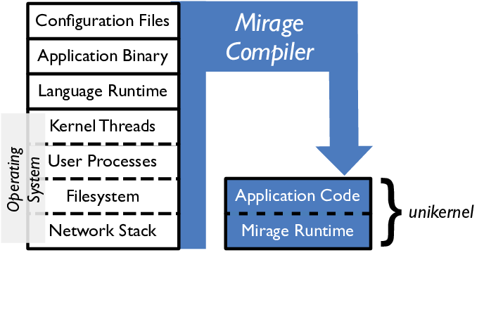
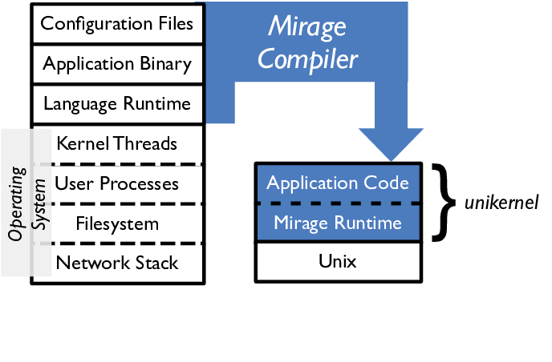
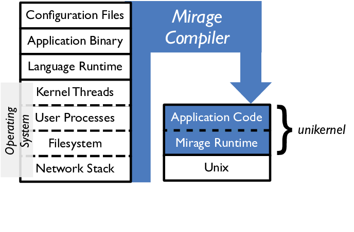
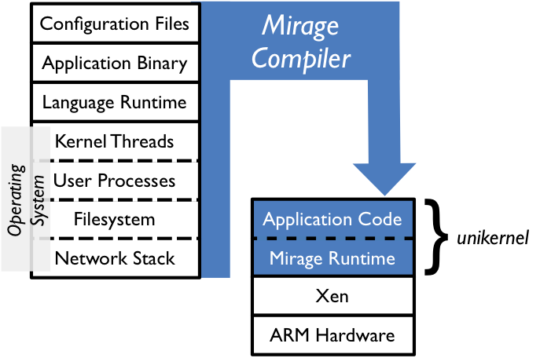

<!-- .slide: class="title" -->

# O'Caml Where Art Thou?

<medium>Magnus Therning</medium>

2015-05-20

----

## What I'll talk about

1. Virtualization
2. MirageOS

## Who am I?

- Email: <magnus@therning.org>
- Twitter: [@magthe](https://twitter.com/magthe)
- LinkedIn: [Magnus Therning](https://www.linkedin.com/pub/magnus-therning/1/a72/608)

----

## Virtualization

## Uses

- Several OSs on one physical machine
    - Building
    - Testing
- Complex network setups
    - Layered networks
    - Tiered server deployments
- OS development
    - Simpler system
    - Limited set of device drivers

## Type 1 - Hypervisor (Xen)

The _hypervisor_ sets up _domains_ for the _guests_ to run in.

The first domain is privileged, called _dom0_ or _Control domain_.

## Device drivers

- _Emulated_ - Emulated in another domain, often _dom0_, exposed to guest via standard means e.g. PCI.
- _Paravirtualized_ - Custom made device for use in virtualization.
- _Dedicated_ - Pass-through of physical device to a single domU.

----

## Introducing [MirageOS](http://openmirage.org/)

- Unikernel 
- OCaml all the way down
- All magic happens via the OCaml module system

## It's All Functional Code

Capture system dependencies in code and compile them away 

  &nbsp;

  

## Retarget By Recompiling

Swap system libraries to target different platforms: 
**develop application logic using native Unix**

  

## Retarget By Recompiling

Swap system libraries to target different platforms: 
**test unikernel using Mirage system libraries**

  

## Retarget By Recompiling

Swap system libraries to target different platforms: 
**deploy by specialising unikernel to Xen**

  

## Retarget By Recompiling

Swap system libraries to target different platforms: 
**...which provides a stable hardware interface**

  

----

## The end

- Xen <http://www.xen.org/>
- MirageOS <http://openmirage.org/>

 

- irmin <https://github.com/mirage/irmin>
- CueKeeper <https://github.com/talex5/cuekeeper>
- Jitsu <https://github.com/mirage/jitsu>
